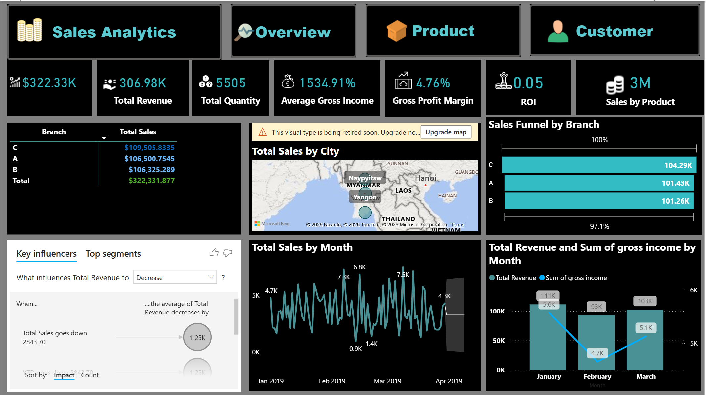
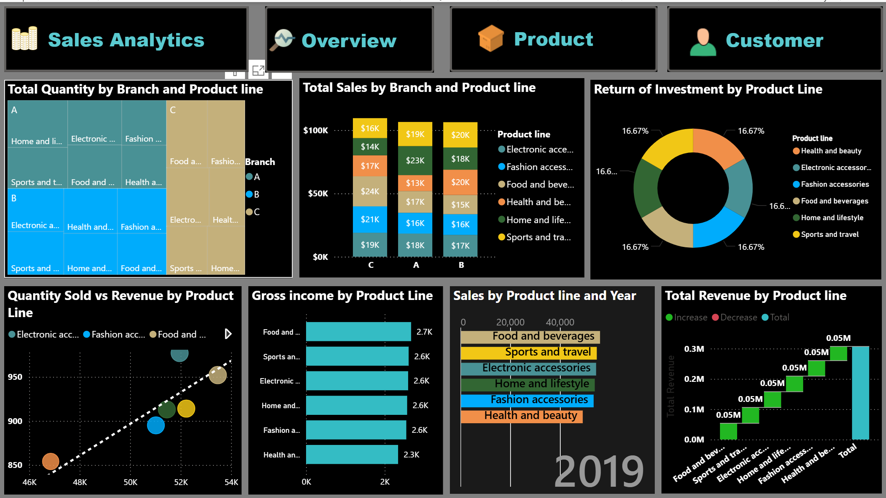

# Sales Analytics Dashboard - Power BI

An interactive sales analytics dashboard built in Power BI, providing insights into sales performance, customer behavior, and product analysis across multiple branches.

-----

## Overview

This project analyzes sales data to identify trends, patterns, and key performance indicators (KPIs) that drive business decisions. The dashboard consists of 4 interactive pages covering different aspects of sales analytics.

-----

## Key Metrics

|Metric              |Value    |
|--------------------|---------|
|Total Revenue       |$322.33K |
|Total Quantity      |5,505    |
|Average Gross Income|$1,534.91|
|Gross Profit Margin |4.76%    |
|Sales by Product    |3M       |

-----

## Dashboard Screenshots

### Overview Page

### Customer Analysis

### KPI Dashboard

### Product Analysis

-----

## Dashboard Pages

### Page 1: Sales Overview

- Total Sales by Branch (A, B, C)
- Total Sales by Product Line
- Product Line Gross & Average Profit Margin
- Total Revenue vs Sum of Quantity by Month
- Interactive filters for Product Line, Branch, Payment, and Customer Type

### Page 2: Customer Analysis

- Proportion of Sales by Customer Type (Member vs Normal)
- Customer Contribution by Payment Method (Cash, E-wallet, Credit Card)
- Total Revenue by Product Line and Gender
- Total Sales by Customer Type and Gender
- Total Revenue by Customer Type and Payment

### Page 3: KPI Dashboard

- Key Performance Indicators (Revenue, Quantity, Gross Income, Profit Margin, ROI)
- Total Sales by Branch breakdown
- Geographic visualization - Total Sales by City
- Sales Funnel by Branch
- Total Sales by Month trend analysis
- Total Revenue and Gross Income by Month

### Page 4: Product Analysis

- Total Quantity by Branch and Product Line (Matrix)
- Total Sales by Branch and Product Line
- Return of Investment by Product Line
- Quantity Sold vs Revenue by Product Line (Scatter Plot)
- Gross Income by Product Line
- Sales by Product Line and Year
- Total Revenue by Product Line (Waterfall Chart)

-----

## Data Source

The dataset contains supermarket sales data including:

- Transaction details
- Product information (6 product lines)
- Customer demographics (Member/Normal, Gender)
- Branch information (A, B, C)
- Payment methods (Cash, E-wallet, Credit Card)
- City locations (Yangon, Naypyitaw, Mandalay)

-----

## Features

- Interactive slicers and filters
- Cross-filtering between visuals
- Key influencers analysis
- Geographic mapping
- Time-based trend analysis
- Drill-through capabilities

-----

## Tools Used

- Power BI Desktop
- DAX (Data Analysis Expressions)
- Power Query for data transformation

-----

## Key Insights

- Branch C leads in total sales ($109.5K), followed by A ($106.5K) and B ($106.3K)
- Food and Beverages is the top-selling product line ($56K)
- Member and Normal customers contribute almost equally (50.86% vs 49.14%)
- E-wallet is the most popular payment method
- Female customers generate slightly higher revenue than male customers
- Sales peaked in January with gradual variations through the quarter

-----

## How to Use

1. Download the `.pbix` file
1. Open with Power BI Desktop
1. Interact with slicers and filters to explore data
1. Click on visuals to cross-filter other charts

-----

## Contact

Mayowa — [GitHub](https://github.com/mayor01)
